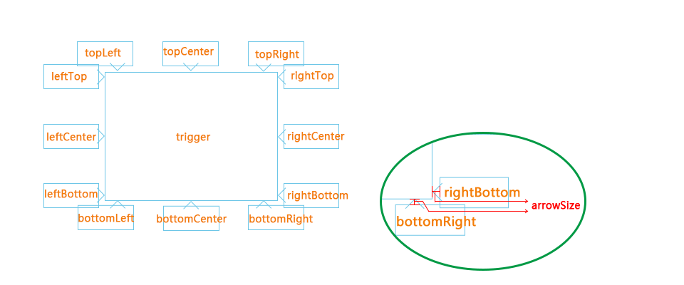

tooltip - jQuery plugin
=======

Tooltip(by icai)  is a  powerful pop tips layer which you can build  your custom theme and it has 12 direction for show.

#### default config： ####

	// default optss
	$.tooltip.defaults = {
		template: undefined,
		content: null,
		loading:null,
		trigger:'hover', // hover click
		selector:false,
		visible:false, // when  the mouse leave the target , over the tips ,tips is visible ?
		timeout: 0,
		zIndex: 1990,
		position:"auto",  // auto left top right bottom
		appendTo:'body',
		offset:[0,25], // [x,y]
		arrowSize:6,
		close: false, // close btn
		center:false,
		callback: function() {}
	};

#### 参数说明： ####

<table class="classtable" cellspacing="0">
    <thead>
      <tr>
        <th width="14%">参数</th>
        <th width="13%">默认值</th>
        <th width="14%">类型</th>
        <th width="59%">描述</th>
      </tr>
    </thead>
    <tbody>
      <tr>
        <td class="code">template</td>
        <td class="code">undefined</td>
        <td class="code">String</td>        
        <td>tip 层 模版 ，可以是 String 常量，也可以是 script 标签的id(#abcd),className(不推荐)，其他选择器</td>                    
      </tr>
      <tr>
        <td class="code">content</td>
        <td class="code">null</td>
        <td class="code">String,Function</td>        
        <td>
当值设定为 String 时，则清空 [ data-tooltip="content" ]  内容区，并插入当前值，

        
当值设定为 Function 时，实现动态插入，调用this.insertContent()

		

        <pre>        content:function(){
        var cnt = ' 1234';
        var fn = this;
          setTimeout(function(){
              fn.insertContent(cnt);
          },2000)
        }</pre>
        

        </td>                    
      </tr>
      <tr>
        <td class="code">loading</td>
        <td class="code">null</td>
        <td class="code">String,Boolean</td>        
        <td>
当值设定为true 时，实现动态加载，并在内容区设定 [ data-tooltip="content" ]，和参数 'content'相互关联。

          
默认loading模版： &lt;p class="defalut_tooltip_loading"&gt;loading....&lt;/p&gt;

          
&nbsp;        

        
当值设定为 String 时，则覆盖默认的loading模版
</td>                    
      </tr>
      <tr>
        <td class="code">trigger</td>
        <td class="code">'hover'</td>
        <td class="code">String</td>        
        <td>可选参数：‘click’</td>                    
      </tr>
      <tr>
        <td class="code">selector</td>
        <td class="code">false</td>
        <td class="code">Boolean</td>        
        <td>selector 不等于false时，实现动态绑定：
          
// 动态 
            $(elem).tooltip({  
            selecotr:'.XXXX' 
            }) 
          

          
//方法原理： 
            $(elem).on(event,selector,function(){ // elem 静态元素 
            // selector 动态元素 
        })
</td>                    
      </tr>
      <tr>
        <td class="code">visible</td>
        <td class="code">false</td>
        <td class="code">Boolean</td>        
        <td>当值设定为 true 时，鼠标能在tip层上停留，和参数 'trigger'相互关联</td>                    
      </tr>
      <tr>
        <td class="code">timeout</td>
        <td class="code">0</td>
        <td class="code">Number</td>        
        <td>不可用</td>                    
      </tr>            
      <tr>
        <td class="code">zIndex</td>
        <td class="code">1990</td>
        <td class="code">Number</td>        
        <td>设定tip层的z-index 值</td>                    
      </tr>       
      <tr>
        <td class="code">position</td>
        <td class="code">'auto'</td>
        <td class="code">String</td>        
        <td>和参数 'center'相互关联，参考<a class="code" href="#pic_1">方向说明</a>图</td>                    
      </tr>
      <tr>
        <td class="code">center</td>
        <td class="code">false</td>
        <td class="code">Boolean</td>        
        <td>和参数 'position'相互关联，参考<a class="code" href="#pic_1">方向说明</a>图</td>                            
      </tr>      
      <tr>
        <td class="code">appendTo</td>
        <td class="code">'body'</td>
        <td class="code">String</td>        
        <td>可选参数：‘after’，设置tip dom 元素追加到 body 或者 目标元素之后</td>                    
      </tr>
      <tr>
        <td class="code">offset</td>
        <td class="code">[0,25]</td>
        <td class="code">Array</td>        
        <td>tip偏移微调，校正箭头对准目标元素,对应x,y</td>                    
      </tr>            
      <tr>
        <td class="code">arrowSize</td>
        <td class="code">6</td>
        <td class="code">Number</td>        
        <td>箭头的宽度或者高度，当箭头绝对定位于在tip 层外面（代码），不适用于最外层包裹（padding）</td>                    
      </tr>       
      <tr>
        <td class="code">close</td>
        <td class="code">false</td>
        <td class="code">Boolean</td>        
        <td>关闭按钮，事件绑定[ data-tooltip="close" ]</td>                    
      </tr>      
      <tr>
        <td class="code">callback</td>
        <td class="code">function(){}</td>
        <td class="code">Function</td>        
        <td>回调函数</td>                    
      </tr>        
             

    </tbody>
  </table>
>
#### 方向说明： ####

更多细节请参考示例

####其他注意事项： ####

 jQuery 1.7 +
 